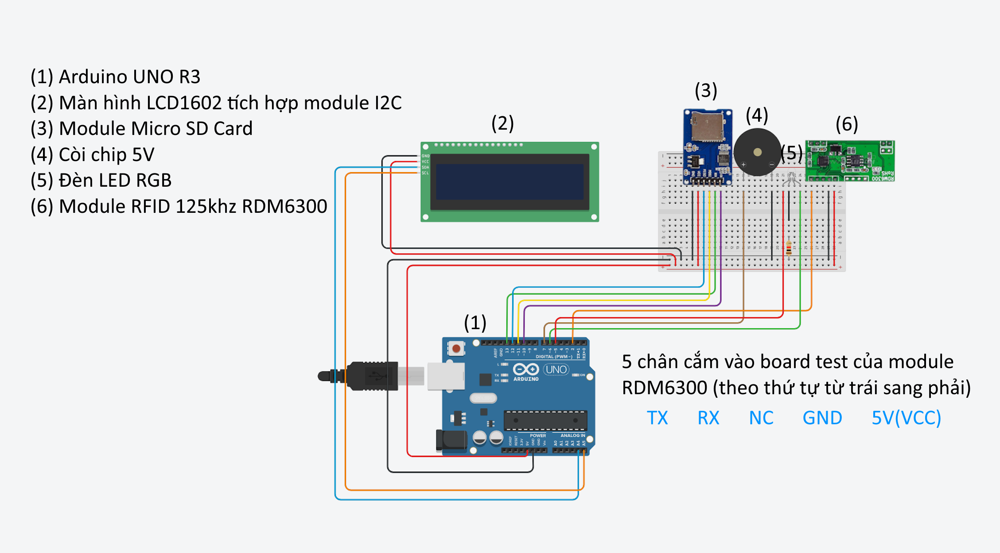
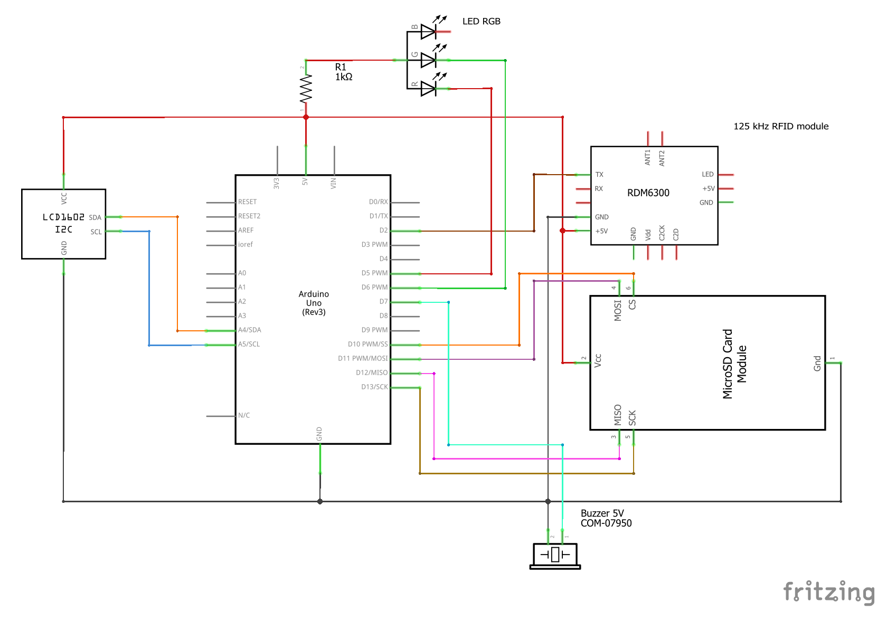

# Mạch sử dụng Arduino UNO R3
## Đèn LED hiển thị trạng thái
- **Màu vàng**: Thiết bị **chưa kết nối** với phần mềm, khi quét thẻ sẽ lưu ID vào thẻ nhớ.
- **Màu xanh**: Thiết bị **đã kết nối** với phần mềm, khi quét thẻ sẽ gửi ID đến phần mềm và không lưu vào thẻ nhớ.
- **Màu đỏ**: Thiết bị **mất kết nối** với thẻ nhớ, mọi chức năng sẽ không hoạt động.

## Video giới thiệu và hướng dẫn sử dụng phần mềm
[Xem video trên YouTube](https://youtu.be/ZJCSwvYm6-4)

## Các thành phần chính của mạch
- **Arduino UNO R3**: Bộ vi điều khiển chính của thiết bị.
- **Module RFID 125kHz RDM6300**: Dùng để đọc ID từ thẻ sinh viên.
- **Module Micro SD Card SPI**: Lưu trữ ID thẻ khi thiết bị chưa kết nối phần mềm.
- **Màn hình LCD 1602**: Hiển thị trạng thái thiết bị, thông tin thẻ sinh viên quét được.
- **Còi chip 5V**: Phát tín hiệu khi quét thẻ thành công.
- **Đèn LED RGB**: Hiển thị trạng thái hoạt động của thiết bị.
- **Pin 9V**: Cung cấp nguồn cho thiết bị.

## Sơ đồ lắp mạch

## Schematic
