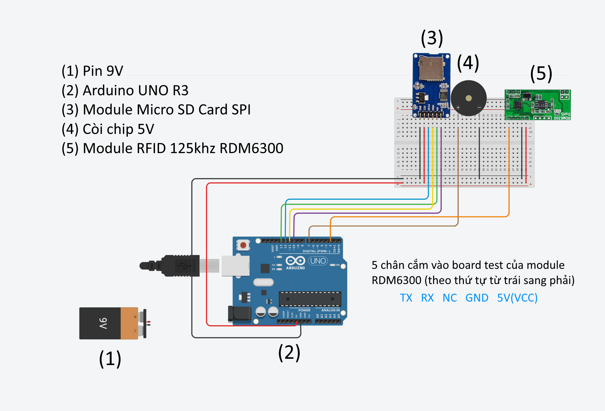

# Thiết bị và Phần mềm Điểm Danh Bằng Thẻ Sinh Viên
Đây là bài tập lớn học phần ET2000 - Nhập môn kỹ thuật điện tử viễn thông của nhóm 3, lớp 153333.

## Giới thiệu

Dự án này phát triển phần mềm và thiết kế một thiết bị điểm danh tự động sử dụng thẻ sinh viên, với sự hỗ trợ của Arduino và ngôn ngữ lập trình C++. Thiết bị giúp quản lý và điểm danh sinh viên nhanh chóng và chính xác thông qua quét thẻ, giảm thiểu sai sót so với phương pháp thủ công.

Mục tiêu của dự án là tạo ra một hệ thống dễ sử dụng, có thể áp dụng trong các trường học, lớp học hoặc các sự kiện đông người. Thiết bị có tính ứng dụng cao, hỗ trợ quản lý thông tin điểm danh hiệu quả.

## Yêu cầu hệ thống
- Máy tính chạy hệ điều hành Windows (khuyến nghị Windows 10 trở lên)

## Cách cài đặt
Phần mềm không yêu cầu cài đặt. Bạn chỉ cần tải phiên bản mới nhất tại phần [Release](https://github.com/TVTIT/ET2000_Project/releases/latest), giải nén file và chạy file `RFID_Arduino.exe`.

## Hướng dẫn sử dụng
1. Kết nối thiết bị với máy tính và mở phần mềm.
2. Lần đầu tiên, phần mềm sẽ yêu cầu bạn nhập cổng COM của Arduino. Để kiểm tra:
   - Chuột phải vào `This PC` -> `Manage` -> `Device Manager` -> `Ports (COM & LPT)`.
   - Tìm tên Arduino UNO và nhập cổng COM vào phần mềm.

   Các lần sau, phần mềm sẽ tự động ghi nhớ và không hỏi lại.

   

## Video giới thiệu và hướng dẫn sử dụng
[Xem video trên YouTube](https://www.youtube.com/watch?v=lwuSDvUjh_Y)

## Các thành phần chính của mạch Arduino
- Arduino UNO R3
- Module RFID 125kHz RDM6300
- Module Micro SD Card SPI
- Pin 9V

## Sơ đồ lắp mạch

