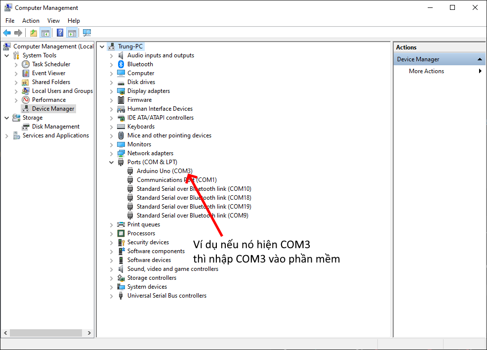

# Thiết bị và Phần mềm Điểm Danh Bằng Thẻ Sinh Viên
Đây là bài tập lớn học phần ET2000 - Nhập môn kỹ thuật điện tử viễn thông của nhóm 3, lớp 153333.

## Giới thiệu

Dự án này phát triển phần mềm và thiết kế một thiết bị điểm danh tự động sử dụng thẻ sinh viên, với sự hỗ trợ của Arduino và ngôn ngữ lập trình C++. Thiết bị giúp quản lý và điểm danh sinh viên nhanh chóng và chính xác thông qua quét thẻ, giảm thiểu sai sót so với phương pháp thủ công.

Mục tiêu của dự án là tạo ra một hệ thống dễ sử dụng, có thể áp dụng trong các trường học, lớp học hoặc các sự kiện đông người. Thiết bị có tính ứng dụng cao, hỗ trợ quản lý thông tin điểm danh hiệu quả.

## Yêu cầu hệ thống
Máy tính chạy hệ điều hành Windows (khuyến nghị Windows 10 trở lên)

## Cách cài đặt
Phần mềm không yêu cầu cài đặt. Bạn chỉ cần tải phiên bản mới nhất tại phần [Release](https://github.com/TVTIT/ET2000_Project/releases/latest), giải nén file và chạy file `RFID_Arduino.exe`.

## Hướng dẫn sử dụng phần mềm  
1. **Kết nối thiết bị**: Kết nối thiết bị với máy tính qua cổng USB.  
2. **Chạy phần mềm**: Mở `RFID_Arduino.exe`.  
3. **Xác định cổng COM của Arduino**:  
   - Chuột phải vào `This PC` → `Manage` → `Device Manager`.  
   - Tìm `Ports (COM & LPT)` và nhập đúng cổng COM hiển thị tên `Arduino Uno` hoặc `USB-SERIAL CH340` vào phần mềm.  
4. Các lần sau, phần mềm sẽ tự động ghi nhớ thông tin và chỉ hỏi lại khi thay đổi cổng COM.

## Cấu trúc thư mục  
- **`src\RFID_Arduino`**: Code của phần mềm kết nối Arduino.  
  *Khuyến nghị mở bằng `Visual Studio 2022` hoặc phiên bản cao hơn.*  
- **`src\RFID_RDM6300`**: Code cho `Arduino UNO R3` **không** sử dụng `module micro SD Card`.  
- **`src\RFID_RDM6300_SDCard`**: Code cho `Arduino UNO R3` sử dụng `module micro SD Card`.  
- **`src\RFID_RDM6300_Wifi`**: Code dành cho `Wemos D1 Wifi ESP8266`.

## Mạch sử dụng Arduino UNO R3
[Xem chi tiết tại đây](Arduino_UNO_R3.md)

## Mạch sử dụng Wemos D1 Wifi ESP8266 và hướng dẫn cài đặt driver
[Xem chi tiết tại đây](Wemos_ESP8266.md)

## Về chúng tôi
Dự án này được thiết kế và xây dựng bởi nhóm 3, lớp 153333 môn Nhập môn Kỹ thuật Điện tử viễn thông (ET2000) của Trường Điện - Điện tử, Đại học Bách khoa Hà Nội học kì 2024.1. Nhóm chúng tôi bao gồm:
- Nguyễn Khắc Tuấn Anh
- Nguyễn Quý Bách
- Đỗ Minh Hiếu
- Trần Vĩnh Trung