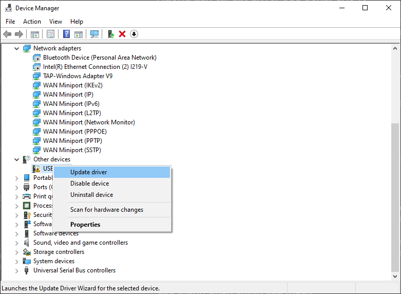
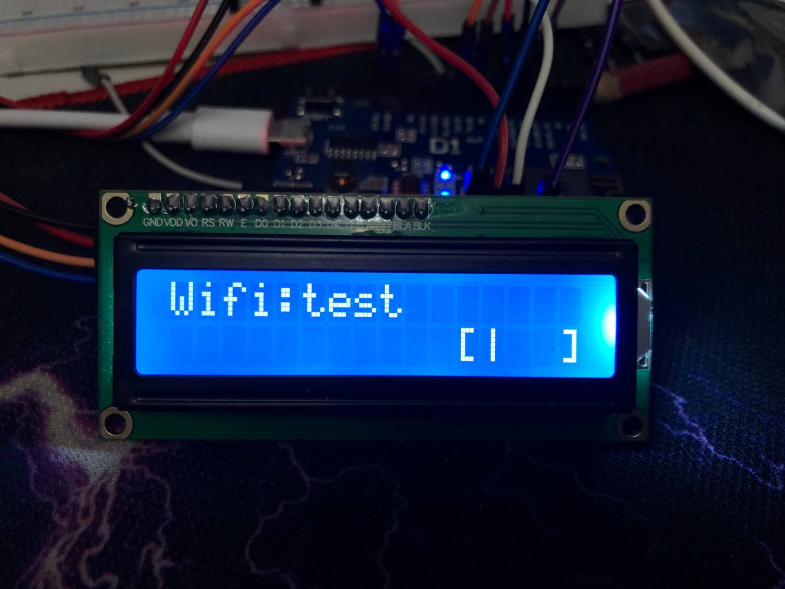
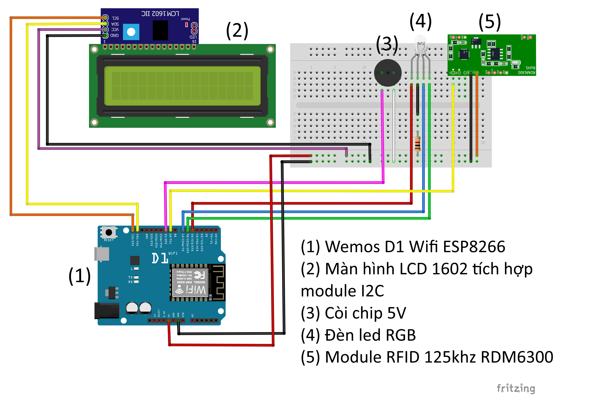

# Mạch sử dụng Wemos D1 Wifi ESP8266

## Hướng dẫn cài đặt driver USB Serial CH340
Trong hầu hết trường hợp, Windows sẽ tự nhận diện và cài đặt driver cho bạn. Tuy nhiên nếu Windows không tự cài đặt driver cho bạn thì bạn có thể tải driver tại [đây](https://www.wch-ic.com/downloads/CH341SER_ZIP.html) và làm theo 1 trong 2 cách bên dưới

### Cách 1: Cài đặt driver tự động
1. Chạy file `SETUP.exe` (hoặc `DRVSETUP64.exe` trong thư mục `DRVSETUP64`).
2. Nhấn nút **INSTALL** để cài đặt driver.

   Nếu hiển thị thông báo **Driver install success!**, điều đó có nghĩa là driver đã được cài đặt thành công.

### Cách 2: Cài driver thủ công
1. Chuột phải vào **This PC** → **Manage** → **Device Manager**.

2. Tìm kiếm `USB Serial` có dấu chấm than, chuột phải và chọn `Update driver`

3. Chọn `Browse my computer for drivers`
4. Chọn `Browse` và tìm đến folder `CH341SER` vừa giải nén
5. Nhấn **Next** và Windows sẽ tự động cài đặt driver cho bạn

## Đèn LED hiển thị trạng thái
- **Màu vàng**: Thiết bị **chưa kết nối** với phần mềm và Wifi; quét thẻ sẽ lưu ID vào bộ nhớ Flash.
- **Màu tím**: Thiết bị **kết nối với phần mềm qua cáp**, ID thẻ quét được sẽ truyền qua dây cắm vào máy tính.
- **Màu đỏ**: Thiết bị **đang kết nối Wifi**.
- **Màu xanh dương**: Thiết bị **đã kết nối Wifi** và chờ tín hiệu từ phần mềm.
- **Màu xanh lá cây**: Thiết bị **kết nối với phần mềm qua Wifi**; ID thẻ quét được sẽ truyền tới phần mềm qua Wifi.

## Cách hiển thị cột sóng Wifi
Do hạn chế của màn hình LCD 1602 nên cột sóng được thiết kế hơi giống hiển thị phần trăm pin trên các thiết bị khác. Cột sóng Wifi có 3 mức độ tương ứng với từng mức độ mạnh yêu của Wifi.

## Các thành phần chính của mạch
- **Wemos D1 Wifi ESP8266**: Bộ vi điều khiển và kết nối Wifi cho thiết bị.
- **Module RFID 125kHz RDM6300**: Dùng để đọc ID từ thẻ sinh viên.
- **Còi chip 5V**: Phát tín hiệu âm thanh khi quét thẻ thành công.
- **Màn hình LCD 1602**: Hiển thị trạng thái thiết bị, thông tin thẻ sinh viên quét được.
- **Đèn LED RGB**: Hiển thị trạng thái hoạt động của thiết bị.
- **Pin 9V** (2 hoặc 3 viên lắp song song): Cung cấp nguồn cho thiết bị.

## Sơ đồ lắp mạch

